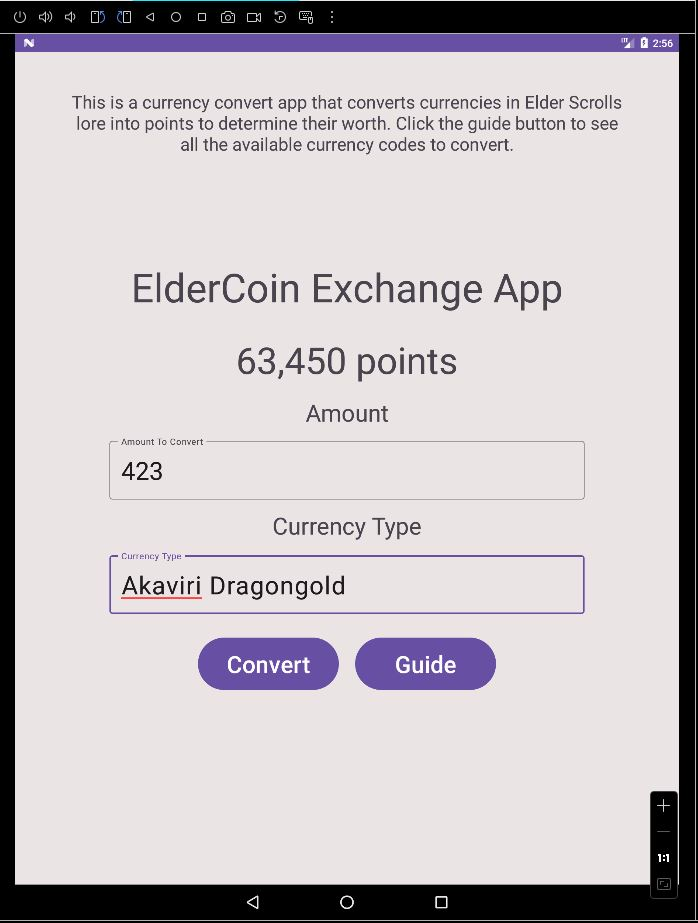
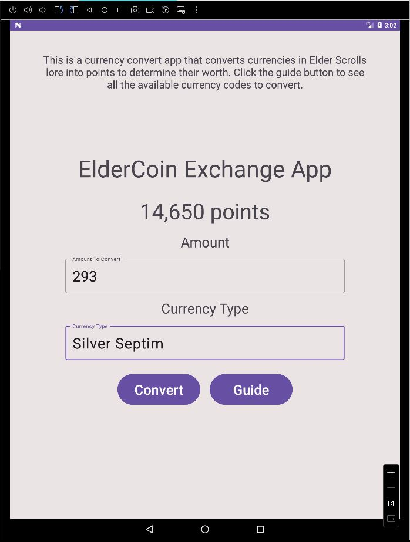
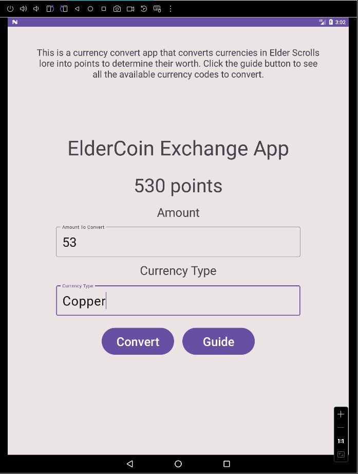
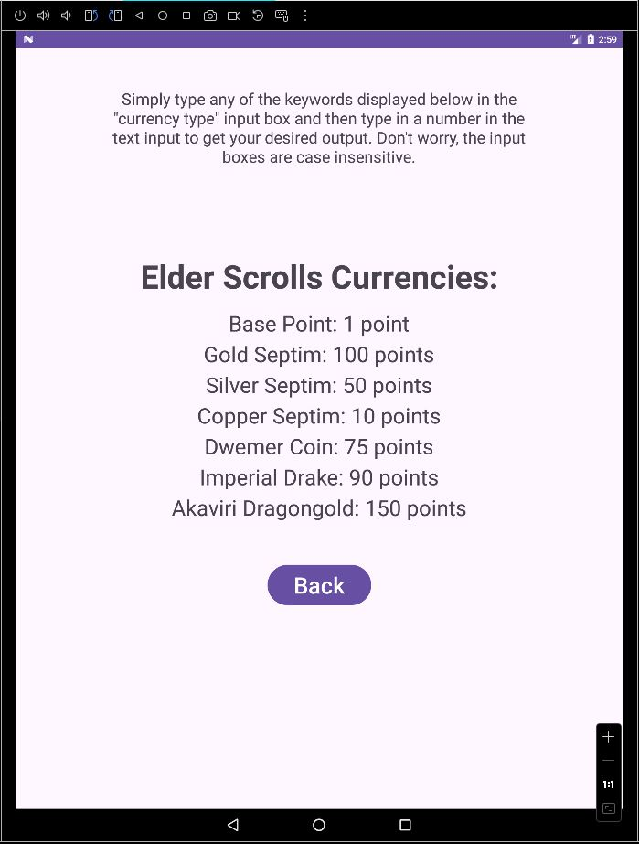

# ElderCoin Exchange App

## Description

A simple Android app made for me to practice learning Android studio. It is a currency converter app for determining the value of currencies in the Elder Scrolls lore into points to determine their worth.

## Resources

- [Elder Scrolls Lore](https://en.uesp.net/wiki/Lore:Main_Page)
- [Elder Scrolls Currencies](https://en.uesp.net/wiki/Lore:Currency)

## Device Tested On

- Android 7.0 Nougat API 24
- 1800x2400 pixels Screen Size

## Images of the application

### Conversion Activity

### Guide Activity

